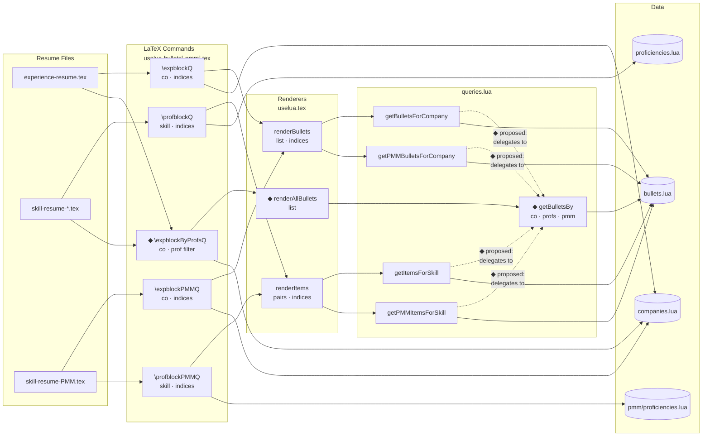

# Query Engine Refactor + Hybrid Experience Block

## Goal

Add a **proficiency-filtered experience block** — job sections whose bullets are selected by
proficiency tag rather than manual index. This enables a hybrid format: proficiency-led
curation, but displayed in the traditional experience/job layout.

The same mechanism extends naturally to the PMM resume once PMM fields are populated.

As part of this, consolidate the four existing query functions into a single composable core
(`getBulletsBy`) that all specific queries delegate to, making future filter combinations
trivial to add.

---

## Current State vs. Proposed

**Current:** Four independent query functions, each reading `bullets.lua` directly.

**Proposed:** One core query function (`getBulletsBy`) with `company`, `profs`, and `pmm`
filter options. Existing functions become thin wrappers — no change to their signatures or
behavior, only their internals.

---

## System Diagram



◆ = new / proposed

---

## Design Decisions

**Ordering** — bullets render in natural `bullets.lua` order (stable, intentional). No
secondary sort by which proficiency tag matched.

**Text field** — `\expblockByProfsQ` uses `experience_text` (job context). The proficiency
filter is selection logic only; it doesn't change which text variant is shown.

**Return shape** — `getBulletsBy` always returns the richer `{company, detail}` pair shape.
Experience-side renderers just ignore the company field. This keeps one return contract
across all query paths.

**Index picking** — not needed for the hybrid command; the proficiency filter is the
selection mechanism. Can be layered on later if needed.

**Renderer placement** — `renderAllBullets` lives in `uselua.tex` alongside `renderBullets`
and `renderItems`.

---

## New Command

```latex
\expblockByProfsQ[CMS,Experimentation]{instapage}
```

Optional arg is the proficiency filter (comma-separated keys). Required arg is the company
key. Matches the existing `\expblockQ` signature shape — optional arg is the "what to show"
parameter, just proficiency keys instead of indices.

Per-company shorthands follow the same pattern as the existing families:

```latex
\expinstapageByProfsQ[CMS,Experimentation]
\expnerdwalletByProfsQ[Analytics,SEO]
```

---

## PMM Extension

Once `pmm_proficiencies` fields are populated in `bullets.lua`, the same pattern applies:

```latex
\expblockByPMMProfsQ[GTM,Positioning]{instapage}
```

Using `pmm_experience_text` as the text field, filtered by `pmm_proficiencies`. The
`getBulletsBy` core handles this via the `pmm` flag — no new query logic needed.

---

## Implementation

### 1. `includes/queries.lua`

Add `getBulletsBy(opts)` core function:

```lua
-- opts: { company=string|nil, profs=table|nil, pmm=bool }
-- Returns array of { company=string, detail=string }
-- profs: filter to bullets having at least one matching tag
-- pmm: if true, use pmm_proficiencies / pmm_experience_text fields
function getBulletsBy(opts)
  ...
end
```

Refactor existing functions to delegate:

```lua
function getBulletsForCompany(company_key)
  local results = getBulletsBy({ company = company_key })
  return map(results, function(r) return r.detail end)
end

-- etc.
```

### 2. `includes/uselua.tex`

Add `renderAllBullets(list)` alongside existing renderers:

```lua
function renderAllBullets(items)
  for _, item in ipairs(items) do
    tex.print("\\item " .. item.detail)
  end
end
```

### 3. `includes/uselua-bullets.tex`

Add `\expblockByProfsQ` command and per-company shorthands.

### 4. `includes/uselua-bullets-pmm.tex`

Add `\expblockByPMMProfsQ` command and per-company shorthands (post PMM tagging work).

---

## Implementation Order

1. `getBulletsBy` core + refactor existing queries + verify existing resumes still compile
2. `renderAllBullets` in `uselua.tex`
3. `\expblockByProfsQ` command + shorthands in `uselua-bullets.tex`
4. Use in a resume to validate
5. PMM variant (`\expblockByPMMProfsQ`) after PMM bullet tagging is complete
